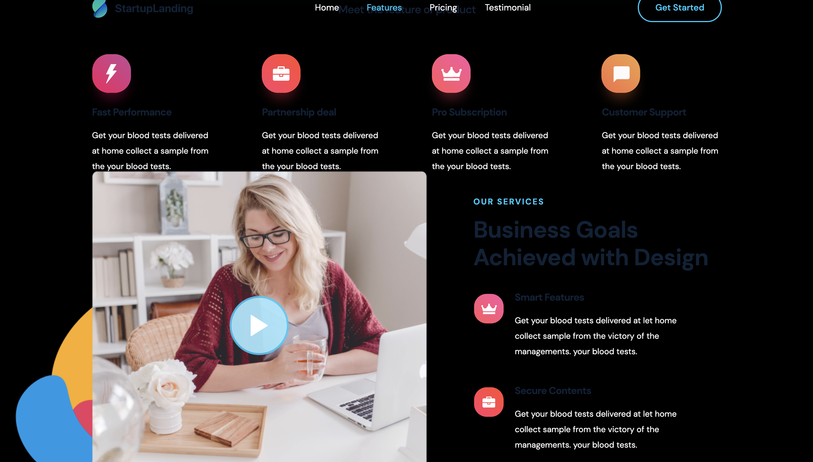
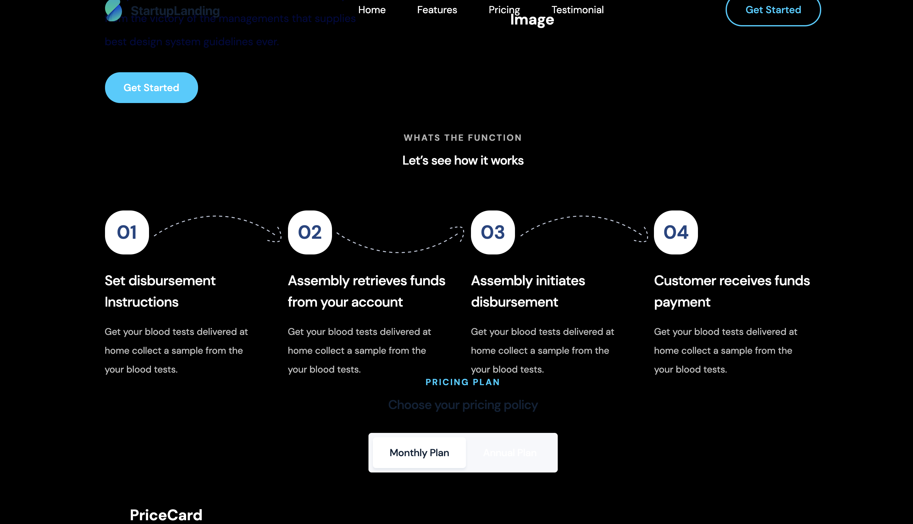

This is a [Next.js](https://nextjs.org/) project bootstrapped with [`create-next-app`](https://github.com/vercel/next.js/tree/canary/packages/create-next-app).

## Getting Started

First, run the development server:

```bash
npm run dev
# or
yarn dev
```

Open [http://localhost:3000](http://localhost:3000) with your browser to see the result.

You can start editing the page by modifying `pages/index.js`. The page auto-updates as you edit the file.

[API routes](https://nextjs.org/docs/api-routes/introduction) can be accessed on [http://localhost:3000/api/hello](http://localhost:3000/api/hello). This endpoint can be edited in `pages/api/hello.js`.

The `pages/api` directory is mapped to `/api/*`. Files in this directory are treated as [API routes](https://nextjs.org/docs/api-routes/introduction) instead of React pages.

## Learn More

[react-scroll - npm](https://www.npmjs.com/package/react-scroll)
[theme-ui - npm](https://www.npmjs.com/package/theme-ui)
[rc-drawer - npm](https://www.npmjs.com/package/rc-drawer)
[react-icons - npm](https://www.npmjs.com/package/react-icons)
[react-custom-scrollbars - npm](https://www.npmjs.com/package/react-custom-scrollbars)
[react-stickynode - npm](https://www.npmjs.com/package/react-stickynode)
[react-modal-video - npm](https://www.npmjs.com/package/react-modal-video)
[typeface-dm-sans - npm](https://www.npmjs.com/package/typeface-dm-sans)

[next-compose-plugins - npm](https://www.npmjs.com/package/next-compose-plugins)
[next-optimized-images - npm](https://www.npmjs.com/package/next-optimized-images)

## Screen Shots



---


